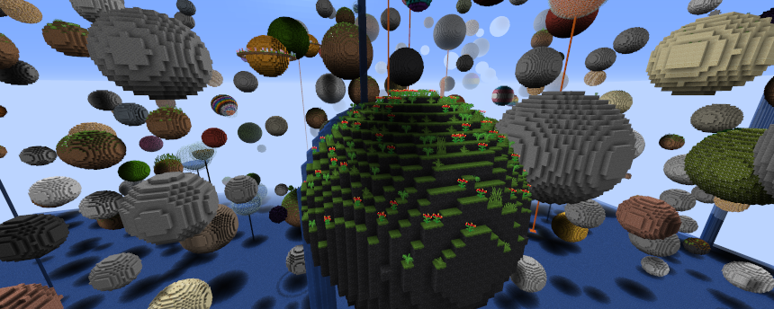

## About Starry Sky

Starry Sky is mod for Minecraft for the fabric mod loader that adds a dimension with that same name. It is a modern revamp of the "planetoids" world generator by Seibai for Minecraft 1.2.5 back in 2012 - although a lot more extensive and with mod support.

## Features

The mod adds a new dimension: The Starry Sky.

The Starry Sky dimension consists out of never ending floating spheres floating in the sky. They can be filled with precious ores or dungeons. But watch out! If you're careless you could very well burn in lava.

## Entering the Starry Sky dimension

Build a **portal out of packed ice** and light it with flint & steel. [can be configured in the config].

Close to 0, 0 will always be a wooden sphere, so if you want to start in the Starry Sky go ahead!

**WARNING:** Due to how custom dimensions are currently implemented by Mojang custom dimensions are only loaded after the second server start!

## Screenshots

## Configuration

You're able to configure how many spheres generate and how much room should be mandatory between each sphere. Also the ground: Fall safely into water, burn the inventory in lava, or fall into the void? Your choice.

Each sphere pack (besides vanilla) can be enabled / disabled. There is a optional Pride pack, that can be enabled, for example if you like it.

## Mod Integration

Vanilla spheres are not enough for you? Starry Sky adds loads of new spheres through mod integration. All mods listed here are fully playable without requiring access to the vanilla Overworld (excluding Nether and The End).

- AppliedEnergistics 2
- Astromine
- Blockus
- Biomes You Go
- Industrial Revolution
- Modern Industrialization
- Sakura Rosea
- Sandwichable
- Tech Reborn
- Terrestria
- Traverse
- Unearthed